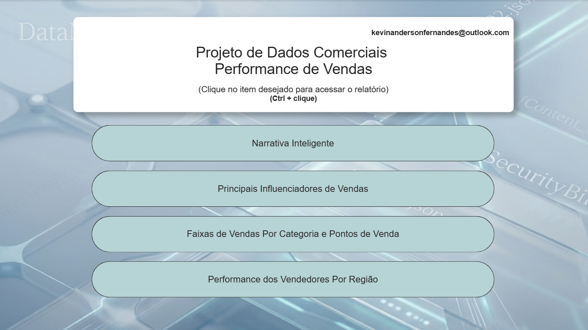

# Dashboard de BI para Análise Comercial - Power BI

Desenvolvimento de solução end-to-end com visões analíticas integradas para monitoramento de performance. O projeto engloba desde a engenharia e modelagem de dados (Star Schema) via Power Query até a criação de métricas avançadas em DAX e uso de recursos de Inteligência Artificial nativos do Power BI para apoio à tomada de decisão.

## 📊 Visões do Dashboard

### 1. Menu Inicial e Navegação
Página de entrada projetada para centralizar o acesso às demais áreas analíticas do relatório.

### 2. Análise Comercial e Distribuição
Monitoramento de receita segmentada cruzando canais físicos, digitais e o mix de produtos.

### 3. Resumo Executivo Automatizado
Uso de machine learning estruturado para gerar relatórios textuais automáticos sobre os principais acontecimentos dos dados.

### 4. Performance da Força de Vendas
Acompanhamento tático do atingimento de metas individuais da equipe comercial filtradas por território.

### 5. Análise de Causalidade (IA)
Mecanismo analítico avançado para entender quais fatores e atributos socioeconômicos ou operacionais mais impulsionam o sucesso das vendas.

## 🛠️ Destaques Técnicos
* **Modelagem de Dados:** Estrutura multidimensional (*Star Schema*) otimizada na etapa de modelagem, separando tabelas fato de dimensões.
* **Processo de ETL:** Extração, limpeza profunda e consolidação de dados utilizando o Power Query.
* **Métricas em DAX:** Fórmulas dinâmicas para automatizar o cálculo de KPIs essenciais de negócio (Faturamento, Margens e Ticket Médio).
* **Recursos Avançados de IA:** Implementação de visuais de Inteligência Artificial (*Key Influencers* e *Smart Narrative*) para geração automatizada de insights.
